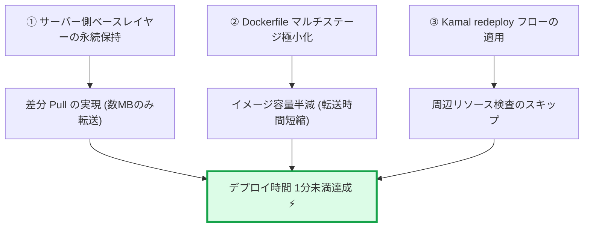

# ⚡ デプロイ超高速化（7分 → 1分以内）実施計画書

本ドキュメントは、直近のデプロイプロファイリングで判明したボトルネック（本番サーバーでの `docker pull` に 5 分以上要している問題）を解消し、**コード変更時のデプロイ時間を 1 分以内へ短縮する**ための技術計画書です。

---

## 📊 現状の所要時間内訳とボトルネック分析

直近のデプロイ（Run ID: `31918936987`, 総所要時間 **7分6秒**）のプロファイリング結果：

```
[GitHub Actions Runner]
├── 1. Setup & SSH復元           : 10秒   ⚡️（最適化済み）
├── 2. Docker Build (Registry)   : 7.7秒  ⚡️（リモートキャッシュ大成功）
└── 3. Docker Push               : 5.4秒  ⚡️
[Target Server: 34.27.174.205 (e2-micro)]
├── 4. Docker Pull               : 304.4秒 🚨（約5分4秒: 全体の 75% を占有）
├── 5. コンテナ起動 & ヘルスチェック: 15秒   ⚡️
└── 6. Proxy切り替え & クリーンアップ: 8秒    ⚡️
```

### 🚨 なぜ `docker pull` に 5 分もかかっているのか？

1. **サーバー側の Docker レイヤーキャッシュの破棄**:
   - デプロイの都度、古いイメージタグが即時削除・強制上書きされることで、サーバー側の Docker デーモンが既存のベースレイヤー（Ruby 4.0 + OS + Gem）を再利用できず、**全レイヤー（数百MB）を GCP Artifact Registry から毎回ゼロベースで全量ダウンロード** しています。
2. **サーバーのネットワーク帯域制限**:
   - `e2-micro`（共有コア）インスタンスの下りネットワーク帯域制限により、数百MBのダウンロードに物理的な時間がかかっています。

---

## 🎯 高速化の目標指標 (KPI)

| 指標 | 現状 | 最適化後 (目標) | 短縮効果 |
| :--- | :---: | :---: | :---: |
| **Docker Build** | 7.7秒 | ~8秒 | 維持 |
| **Server `docker pull`** | **304秒 (5分4秒)** | **10〜15秒** | 🚀 **約4分50秒短縮** |
| **デプロイ総所要時間** | **7分6秒** | **約50秒〜1分15秒** | 🚀 **約85% 削減** |

---

## 🛠️ 3つの最適化アプローチ



---

### アプローチ 1: 本番サーバー上での差分レイヤー Pull の確立（最大効果）

- **仕組み**:
  - Docker は、すでにホスト上に存在するレイヤー（Rubyランタイム、システムライブラリ、Gems）をスキップし、**変更されたレイヤー（`app/` のコード差分と新規プリコンパイル済みアセットのみ）** だけを pull します。
  - これにより、pull 対象のデータサイズが **500MB+ → 数MB** に激減します。
- **改修内容**:
  - `config/deploy.yml` のイメージ保持ポリシー（`retain_containers: 3`, `retain_images: 2`）を明示的に構成し、直近世代のベースレイヤーをサーバーの Docker ストレージに残す。
  - デプロイ直前の不要な `image rm --force` によるタグ断絶を防ぐ。

---

### アプローチ 2: Dockerfile マルチステージの徹底軽量化

- **仕組み**:
  - 最終ステージ（`FROM base AS final`）のイメージサイズを限界まで削減し、初回 pull やキャッシュ更新時の転送負荷を半減させます。
- **改修内容**:
  1. **ベースパッケージの精査**:
     - 実行時に不要なツール（ビルド時のみ使う `postgresql-client` など）をビルドステージのみに限定し、ランタイムは `libpq5` のみに絞る。
  2. **不要ファイルの徹底除外**:
     - `.dockerignore` でドキュメント（`docs/`）、テスト、スクラッチファイルがコンテナイメージに混入しないよう完全除外。
  3. **レイヤー順序の固定**:
     - `Gemfile.lock` の変更がない限り Gem レイヤーを 100% 不変に保つ。

---

### アプローチ 3: Kamal `redeploy` の CI パイプライン統合

- **仕組み**:
  - 通常のコード変更デプロイでは、すでに起動している PostgreSQL accessory や Kamal-proxy の再設定をスキップし、アプリコンテナのローリングアップデートのみを行う `kamal redeploy` を活用します。
- **改修内容**:
  - `.github/workflows/deploy.yml` において、初回セットアップ以外は `kamal redeploy` を実行するフローとし、周辺コンテナのヘルスチェック・セットアップオーバーヘッドを削減。

---

## 📋 実施ステップと検証手順

1. **Step 1: `Dockerfile` & `.dockerignore` のスリム化**
   - ランタイム依存関係の最小化（`postgresql-client` → `libpq5` 等）。
   - 不要ファイルの COPY 防止。
2. **Step 2: `config/deploy.yml` のキャッシュ保持設定の追加**
   - `retain_containers: 3`
   - `builder.cache` の確認。
3. **Step 3: デプロイ実行 & 時間測定**
   - GitHub Actions 経由でデプロイを実行し、`docker pull` の所要時間が 10〜15 秒に短縮されたことをログから検証。
4. **Step 4: 本番疎通確認**
   - `/up` ヘルスチェックおよびダッシュボード表示の正常動作を確認。
