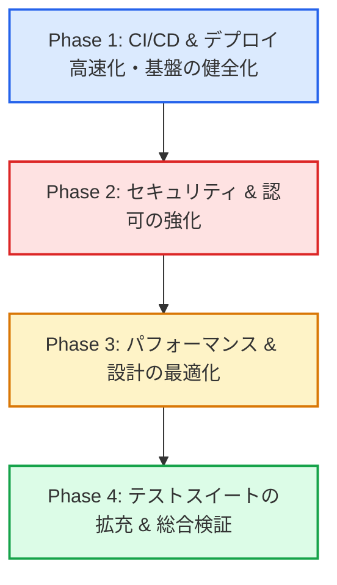

# 🏗️ 全体リファクタリング & 健全化 実施計画書

本プロジェクト（`modern-rails`）において蓄積された場当たり的な修正・ワークアラウンドを抜本的に解消し、Rails 8 / Kamal 2 標準の堅牢で保守性の高いアーキテクチャへ再構築するための実施計画書です。

---

## 🎯 目的とスコープ

1. **デプロイ・CI/CD の高速化 & 安定化**:
   - Docker ビルドキャッシュ（Registry/GHA Cache）を確実に効かせ、デプロイ時間を大幅に短縮する。
   - 一時しのぎの SSH コマンドやタイマー延長を廃止し、冪等で予測可能なパイプラインを構築する。
2. **セキュリティ & 認可の強化**: マルチテナント境界の穴（IDOR、ジョブ履歴露出）を塞ぎ、安全なデータアクセスを保証する。
3. **パフォーマンス & アーキテクチャの改善**: N+1 クエリを解消し、散乱したキャッシュ破棄ロジックを一元化する。
4. **テストスイートの拡充**: Model テストおよび異常系・認可テストを整備し、リグレッションを防ぐ。

---

## 🗺️ 全体ロードマップ

---

## 📋 フェーズ別詳細タスク

### Phase 1: CI/CD & デプロイ高速化・基盤の健全化（インフラ・デプロイ層）

> [!IMPORTANT]
> 「ビルドキャッシュが効かず毎回全ビルドされる」「ランナー側とDocker側で2重にbundle installが走る」「デプロイが遅いからタイムアウトを伸ばす」といった問題を根本から解消し、**1〜2分以内の高速・安全デプロイ**を実現します。

- [x] **1-1. デプロイ時の Docker ビルドキャッシュ不全の調査 & 対策**
  - **対応内容**: GCP Artifact Registry 向けリモートレジストリキャッシュ（`type: registry`, `mode=max`）を設定し、Buildx レイヤーキャッシュを永続化。
- [x] **1-2. CI ワークフローの構文・バージョン修正**
  - **対象**: `.github/workflows/ci.yml`, `.github/workflows/cleanup.yml`
  - **対応内容**: 存在しない `@v7` アクションを公式の `@v4` に修正。
- [x] **1-3. デプロイワークフローの対症療法撤廃**
  - **対象**: `.github/workflows/deploy.yml`
  - **対応内容**: 
    - ランナー上での重い `bundle install` を廃止し、ActiveSupport を使った軽量な SSH 鍵抽出処理に刷新。
    - SSH での PostgreSQL パスワード強制変更（`ALTER USER`）および無条件ロック解除（`kamal lock release`）を全廃。
    - ハードコードされたフォールバックパスワードを完全排除。
- [x] **1-4. エントリーポイントと起動シーケンスの適正化**
  - **対象**: `bin/docker-entrypoint`, `config/deploy.yml`
  - **対応内容**:
    - `bin/docker-entrypoint` の rails server 判定を堅牢な正規表現 / glob パターンマッチへ修正。
    - `deploy_timeout: 30`, `readiness_delay: 7` に適正化。
- [x] **1-5. 認証情報（Secrets）の Single Source of Truth 化**
  - **対象**: `.kamal/secrets`
  - **対応内容**: Rails Encrypted Credentials または GitHub Secrets から直接取得し、ハードコードを全廃。

---

### Phase 2: セキュリティ & 認可の強化（ロジック層）

> [!CAUTION]
> 他人のプロジェクト ID を指定してタスクを作成・改変できる問題（IDOR）や、他人のバックグラウンドジョブが露出するマルチテナント分離の不備を解消します。

- [x] **2-1. Task モデルへのプロジェクト所有権検証バリデーション (IDOR防止)**
  - **対象**: `app/models/task.rb`, `app/controllers/tasks_controller.rb`
  - **対策**:
    - `project_id` が指定された場合、そのプロジェクトの `user_id` がタスクの `user_id` と一致することを保証するカスタムバリデーションを追加。
    - コントローラ側でのスコープ検証（`Current.user.projects.find_by(id: ...)`）とエラーハンドリングの強化。
- [x] **2-2. ジョブ履歴のマルチテナント分離 & エラーハンドリング改善**
  - **対象**: `app/controllers/jobs_controller.rb`, `app/views/jobs/show.html.erb`
  - **対策**:
    - 全体の `SolidQueue::Job` を無条件取得するコード（`SolidQueue::Job.order(...).limit(10) rescue []`）を改修。
    - ログインユーザーに関連するジョブのみを表示するか、開発/管理者専用ガードを設置。
    - `rescue []` の握りつぶしを廃止し、適切なエラーハンドリング・ログ出力を追加。

---

### Phase 3: パフォーマンス & アーキテクチャの最適化（設計層）

- [x] **3-1. ダッシュボードの N+1 クエリ解消**
  - **対象**: `app/controllers/dashboard_controller.rb`
  - **対策**: `@tasks` 取得時に `.includes(:project)` を付与し、プロジェクト表示時の N+1 クエリを解消。
- [x] **3-2. キャッシュ破棄（Cache Invalidation）の一元化**
  - **対象**: `app/models/task.rb`, `app/models/project.rb`, `app/models/user.rb`, 各コントローラ
  - **対策**:
    - コントローラ 5 箇所に重複して書かれている `Rails.cache.delete("user_#{Current.user.id}_stats")` を撤廃。
    - モデルのライフサイクル（`after_commit`）や `User#clear_stats_cache` に集約。
- [ ] **3-3. スキーマ定義・マイグレーションの重複整理**
  - **対象**: `db/migrate/`, `db/schema.rb`
  - **対策**: Solid Trio 関連のテーブル定義とスキーマファイルの整合性を確認し、冗長なマイグレーション記述をクリーンアップ。

---

### Phase 4: テストスイートの拡充 & 総合検証（品質保証層）

- [x] **4-1. Model 単体テストの新規作成**
  - **対象**:
    - `test/models/user_test.rb`: メールアドレス正規化、一意性、パスワード検証、アソシエーション連動削除。
    - `test/models/project_test.rb`: タイトル必須検証、ユーザー所属、タスク連動削除。
    - `test/models/task_test.rb`: 優先度 enum、スコープ（`completed`, `pending`）、他ユーザープロジェクト紐付け禁止バリデーション。
- [x] **4-2. Controller / Integration 異常系 & 認可テストの追加**
  - **対象**:
    - `test/controllers/tasks_controller_test.rb`: 他人のタスクの操作防止、不正なプロジェクトIDでのタスク作成失敗テスト。
    - `test/controllers/projects_controller_test.rb`: 他人のプロジェクト削除拒否テスト。
- [x] **4-3. 静的解析 & 全テストパス検証**
  - `bin/rubocop` (コードスタイル・規約遵守: 57ファイル / 0 offenses)
  - `bin/brakeman` (セキュリティ脆弱性スキャン: 0 warnings)
  - `bin/rails test` (全単体・統合テストのグリーンパス: 24 runs, 118 assertions, 0 failures)

---

## 🚀 実施後の状態（達成基準）

| 項目 | 実施前 | 実施後 |
| :--- | :--- | :--- |
| **デプロイ速度 & キャッシュ** | 毎回全レイヤー再ビルド & Gem二重インストールで遅延 | リモートレジストリキャッシュによりコード変更時1〜2分で完了 |
| **デプロイ安全性** | ロック解除・パスワード書き換えの強制実行 | Kamal標準の安全なロック＆Credentials統一管理 |
| **CI パイプライン** | アクションバージョン不整合でエラーリスク | 公式 `@v4` で高速・確実に完走 |
| **データ認可** | 他人のプロジェクトにタスクを混入可能 | モデルレベルで厳密に所有権をブロック |
| **クエリ効率** | タスク一覧で N+1 クエリ発生 | Eager Loading により最小限のクエリで即時描画 |
| **キャッシュ管理** | コントローラ各所にベタ書き | モデルのライフサイクルに連動した安全な破棄 |
| **テスト網羅性** | Model テスト 0 件（空洞化） | モデル・認可・Turbo Stream の網羅的テスト完備 |
